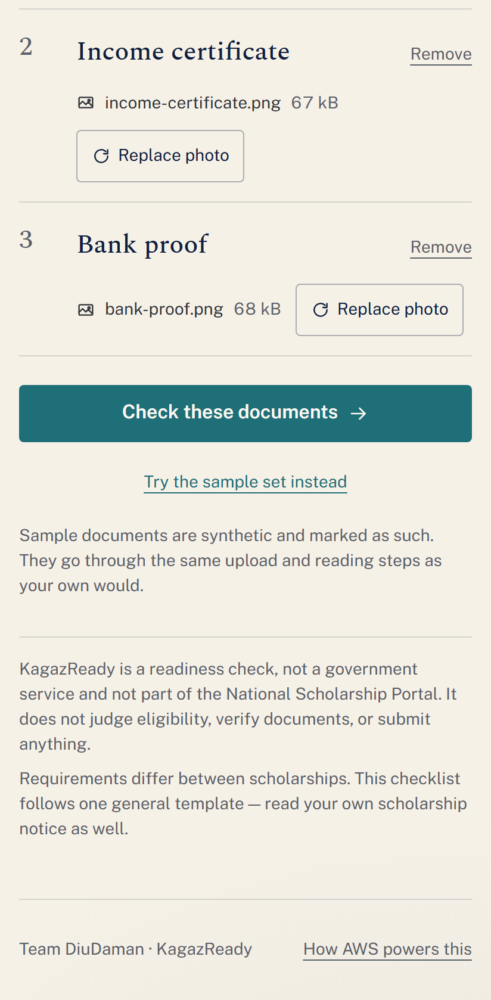
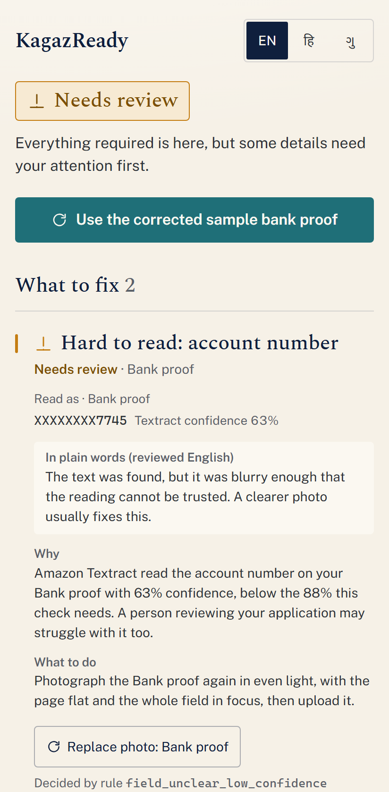
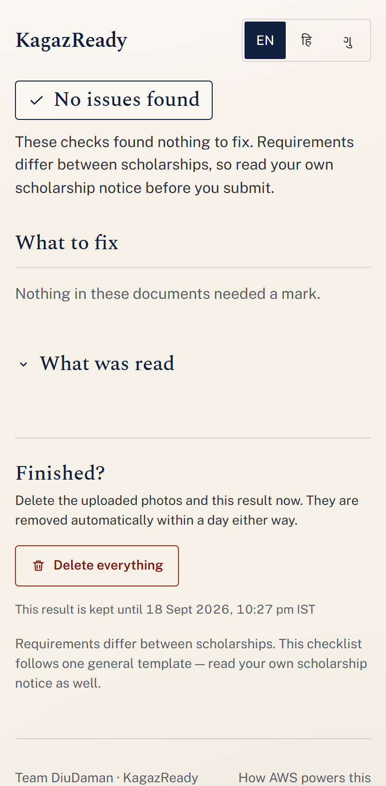

# KagazReady

**Check the paperwork before the portal checks you.**

KagazReady is a document-readiness assistant for Indian students preparing a scholarship
application. Upload a Class XII marksheet, an income certificate and a bank proof; Amazon Textract
reads them, deterministic rules look for what a portal or a reviewer would send back — a missing
document, an unreadable account number, a name spelt three different ways — and the student gets an
evidence-backed correction list in English, Hindi or Gujarati.

- **Live:** https://main.d109ovvm872kui.amplifyapp.com — the "Try the sample set" link runs the
  whole journey on synthetic documents, so nothing personal is needed to see it work.
- **Team:** DiuDaman · WeMakeDevs × AWS "First Commit" (Bharat Builds Tour, 17–20 Sept 2026).
- **Track:** Ship It — deployed on AWS with a public URL. Also in the running for Best UI, as every
  submission is.
- **Blog:** [We built a scholarship paperwork checker in four days. Textract taught us the
  most.](https://builder.aws.com/content/3JVSGeqFIuVHSRysXPRuzpuHtQ3/we-built-a-scholarship-paperwork-checker-in-four-days-textract-taught-us-the-most) on AWS Builder Center.

KagazReady is **not** a government service, is not affiliated with the National Scholarship Portal,
does not evaluate eligibility, does not check authenticity, does not submit applications, and does
not promise approval. The only three things it will ever say about a set of documents are
**Incomplete**, **Needs review**, or **No issues found**.

## What it looks like

The interface is a proof sheet: three ruled rows, one per document, and every finding is a
proofreader's mark tied to the exact line that was read.

| Compose                                            | Needs review                                                  | Clean                                                          |
| -------------------------------------------------- | ------------------------------------------------------------- | -------------------------------------------------------------- |
|  |  |  |

Every mark carries: the status in words, which document, the masked value that was read
(`XXXXXXXX7745 · Textract confidence 63%`), a plain-words note, why it matters, what to do, and the
rule that decided it. Bank account numbers are masked to the last four digits before they are
stored, logged, rendered or sent anywhere.

## How it works

```
Browser (React · Vite · TypeScript · Tailwind · GSAP) on Amplify Hosting
   │  POST /uploads          → presigned S3 POST (key, type and size pinned; minutes to live)
   │  POST → private S3      Block Public Access, SSE, 1-day lifecycle, TLS-only
   │  POST /analyses         → Lambda: verify objects → Textract DetectDocumentText
   │                                   → deterministic rules → mask → Bedrock (rephrase only)
   │                                   → DynamoDB with TTL
   │  GET  /analyses/{id}    → read (with ?language= for hi / gu)
   │  PUT  /analyses/{id}/documents/{type}   → replace one document and re-run
   │  DELETE /analyses/{id}  → immediate deletion of the result and every uploaded object
```

**The status is decided by code, never by a model.** `packages/rules` is a pure, exhaustively
tested TypeScript engine — Unicode-aware name comparison (Devanagari and Gujarati conjuncts
preserved), account masking, IFSC structure, Indian date parsing with ambiguity detection, and
OCR-confidence thresholds. Amazon Bedrock is called only _after_ the status is final, and may only
restate an existing finding in simpler words or translate it. Its output is schema-validated,
decision words are rejected, and any failure falls back to reviewed English copy — a Bedrock
failure is never an analysis failure. See [docs/architecture.md](docs/architecture.md).

The ten rules: `required_document_missing`, `required_field_missing`,
`field_unclear_low_confidence`, `name_minor_difference`, `name_material_difference`,
`bank_ifsc_invalid_format`, `bank_account_number_implausible`, `date_ambiguous`, `date_in_future`,
`date_unparseable`.

## Repository layout

| Path                     | Contains                                                                       |
| ------------------------ | ------------------------------------------------------------------------------ |
| `packages/contracts`     | Zod schemas, shared types, the versioned scholarship template                  |
| `packages/rules`         | The deterministic rule engine and reviewed copy in en / hi / gu. No I/O.       |
| `services/api`           | Four Lambda handlers and thin adapters for S3, Textract, DynamoDB and Bedrock  |
| `services/template.yaml` | AWS SAM: S3, DynamoDB, HTTP API, four least-privilege roles, log groups        |
| `apps/web`               | The frontend, its tests, and the Playwright demo journey                       |
| `fixtures`               | Generator for the synthetic demo documents (every one stamped as synthetic)    |
| `scripts`                | `deploy-web.py` — zip and deploy the built frontend to Amplify Hosting         |
| `docs`                   | Architecture, design system, threat model, cost, cleanup, research, submission |

## Running it

Requirements: Node 22+, npm 10+, Python 3 (for the fixture PNGs and the Amplify deploy script),
AWS CLI v2 and AWS SAM CLI for deployment.

```bash
npm install
npm run verify                      # format:check + lint + typecheck + all tests + build
npm run fixtures -- apps/web/public/samples   # regenerate the synthetic sample documents
```

Frontend against a deployed API:

```bash
cp apps/web/.env.example apps/web/.env.local   # set VITE_API_BASE_URL
npm run dev -w apps/web
```

Backend:

```bash
npm run build -w @kagazready/api    # esbuild bundles into services/api/dist (see CLAUDE.md for why)
cd services
sam validate --lint --template template.yaml
sam build --template template.yaml
sam deploy --guided                 # first time; afterwards: sam deploy
```

Then build the frontend with `VITE_API_BASE_URL` set to the stack's `ApiBaseUrl` output and run
`python scripts/deploy-web.py`. Full details, including the Amplify security headers, are in
[docs/architecture.md](docs/architecture.md); tearing everything down is in
[docs/aws-cleanup.md](docs/aws-cleanup.md).

## Verification

Nothing in this repository is claimed to pass unless it ran. `tests.json` is the ledger (70
passing, 1 blocked, 2 not run at the time of writing) and [VERIFICATION.md](VERIFICATION.md) is the
narrative: 222 unit and handler tests, 8 live Textract tests, 18 Playwright runs against the public
URL in three viewports, and the smoke tests performed on the deployed stack.

The one blocked check is the live Bedrock smoke test: this new AWS account has every Bedrock
request quota set to zero, so the deployment runs with the model deliberately unconfigured and the
fallback path — reviewed English notes, `explanationsDegraded: true` reported honestly — is what
is live. Details in [docs/limitations.md](docs/limitations.md).

## Privacy and security in one paragraph

Uploads go straight from the browser to a private bucket under a presigned policy; the API never
sees file bytes. Textract output lives only in Lambda memory. Results are stored masked, with a
six-hour TTL that the code also enforces; objects expire within a day or two; **Delete** removes both at
once.
Logs are redacted of digit runs and kept for seven days. No accounts, no cookies, no analytics, no
Aadhaar. [PRIVACY.md](PRIVACY.md) and [SECURITY.md](SECURITY.md) say the rest;
[docs/threat-model.md](docs/threat-model.md) says what was accepted and why.

## Documentation

- [docs/architecture.md](docs/architecture.md) — services, data flow, regions, the Bedrock boundary
- [docs/design-system.md](docs/design-system.md) and [apps/web/DESIGN.md](apps/web/DESIGN.md)
- [docs/threat-model.md](docs/threat-model.md) · [SECURITY.md](SECURITY.md) · [PRIVACY.md](PRIVACY.md)
- [docs/cost-estimate.md](docs/cost-estimate.md) · [docs/aws-cleanup.md](docs/aws-cleanup.md)
- [docs/user-research.md](docs/user-research.md) — how the problem was identified, honestly scoped
- [docs/demo-script.md](docs/demo-script.md) · [docs/judge-questions.md](docs/judge-questions.md)
- [docs/submission-writeup.md](docs/submission-writeup.md) · [docs/limitations.md](docs/limitations.md) · [docs/builder-center-blog.md](docs/builder-center-blog.md)
- [VERIFICATION.md](VERIFICATION.md) · `tests.json` · `progress.md`

## What we learned

Textract's confidence is nearly bimodal on printed text (only glyph ambiguity lowers it);
CloudFormation hands an unset parameter to Lambda as an empty string; SAM's esbuild builder cannot
see a workspace-hoisted esbuild; a new AWS account can have every Bedrock quota at zero; PowerShell's
`Compress-Archive` produces a zip Amplify cannot serve. Each one is written up, with the fix, in
[docs/submission-writeup.md](docs/submission-writeup.md#what-we-learned) and `progress.md`.

## AI disclosure

This project was built with Claude Code (Claude Opus 5) acting as pair programmer across the whole
build, with the team directing scope, approving every AWS action and design decision, and owning
the result. Design passes used the Impeccable and Emil Kowalski skill collections;
[ATTRIBUTIONS.md](ATTRIBUTIONS.md) lists them. The product itself uses Amazon Bedrock only to
rephrase decisions already made by deterministic code — never to make them.

## Licence

MIT — see [LICENSE](LICENSE).
